## Input-according-to-MATLAB-inverse-function-in-Robot-Manipulator
> Authors:	Seonghyeon Jo(cpsc.seonghyeon@gmail.com)
> 
> Date:		 Feb, 07, 2022

Comparison of input from robot manipulator due to computational error for MATLAB inverse function.
[0] : identity matrix

[1] : inverse matrix

(https://kr.mathworks.com/help/matlab/ref/inv.html)

[2] : Moore-Penrose pseudoinverse function 

(https://kr.mathworks.com/help/matlab/ref/pinv.html)

[3] : mldivide, mrdivide function

(https://kr.mathworks.com/help/matlab/ref/mldivide.html)

(https://kr.mathworks.com/help/matlab/ref/mrdivide.html)

[4] : round, mldivide, mrdivide function

## result table

1. mean(u_r - u)

| Method  |     0      |     1      |     2      |       3        |     4      |
| :-----: | :--------: | :--------: | :--------: | :------------: | :--------: |
| joint 1 | 1e-00\*0.0 | 1e-14\*0.5 | 1e-13\*0.4 | **1e-14\*0.1** | 1e-00\*0.0 |
| joint 2 | 1e-00\*0.0 | 1e-15\*0.8 | 1e-14\*0.6 | **1e-15\*0.2** | 1e-00\*0.0 |

2. mean(abs(I-B))

| Method |       0        |       1        |       2        |       3        |       4        |
| :----: | :------------: | :------------: | :------------: | :------------: | :------------: |
| (1,1)  |   1e-00\*0.0   |   1e-16\*0.6   |   1e-14\*0.1   |   1e-16\*0.5   |   1e-00\*0.0   |
| (1,2)  |   1e-00\*0.0   |   1e-16\*0.1   |   1e-15\*0.2   |   1e-17\*0.8   |   1e-00\*0.0   |
| (1,3)  |   1e-00\*0.0   |   1e-15\*0.5   |   1e-14\*0.4   |   1e-15\*0.1   |   1e-00\*0.0   |
| (1,4)  |   1e-00\*0.0   |   1e-16\*0.6   |   1e-15\*0.6   |   1e-16\*0.1   |   1e-00\*0.0   |
|  mean  |   1e-00\*0.0   |   1e-15\*0.2   |   1e-14\*0.2   | **1e-16\*0.5** |   1e-00\*0.0   |

## result figures

### 0. identity matrix
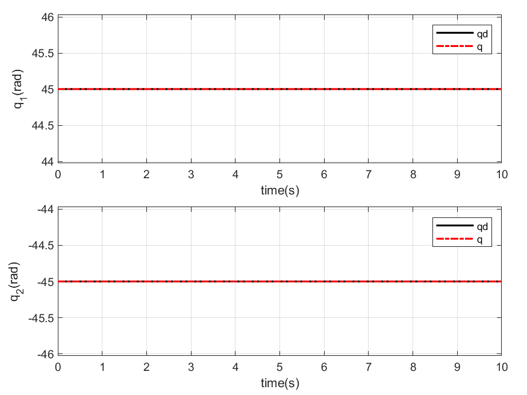 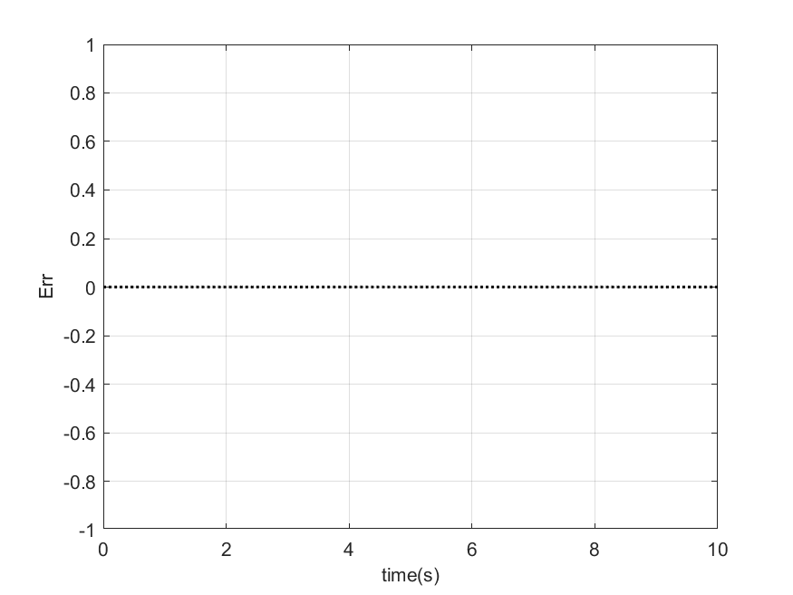 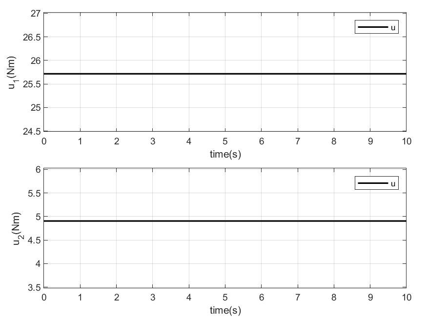 

### 1. inverse function
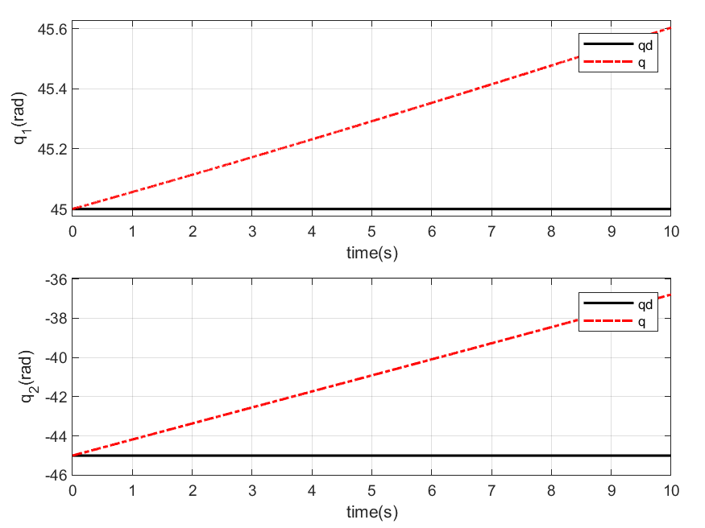 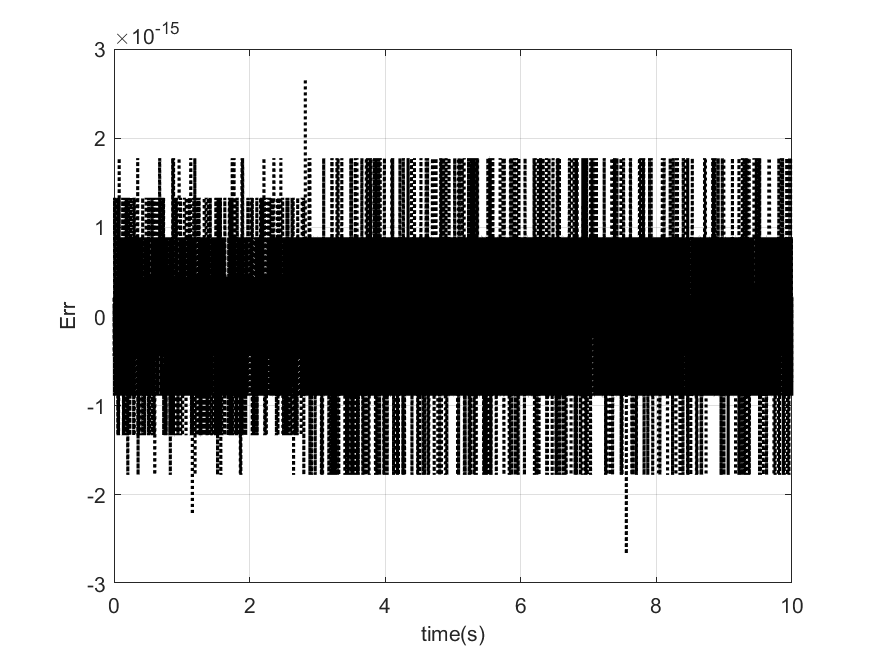 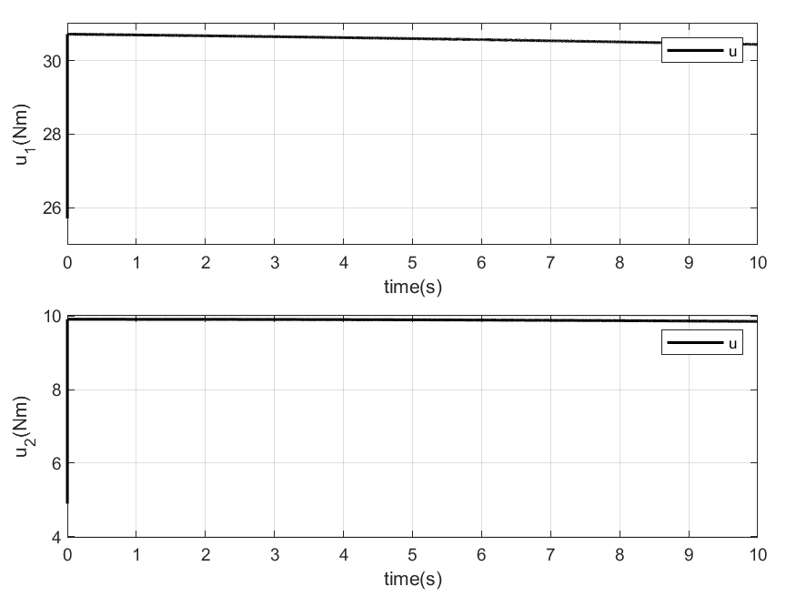 

### 2.  Moore-Penrose pseudoinverse function
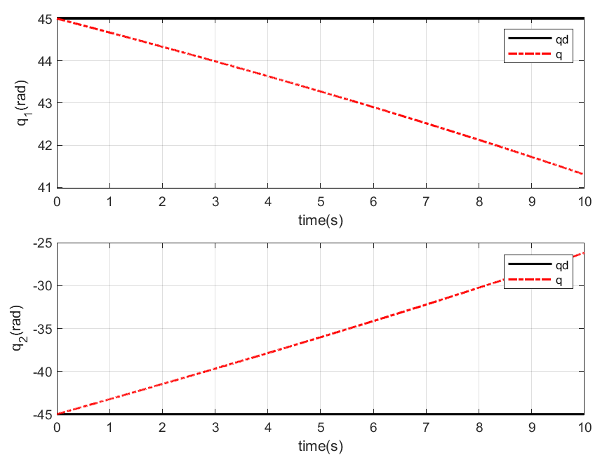 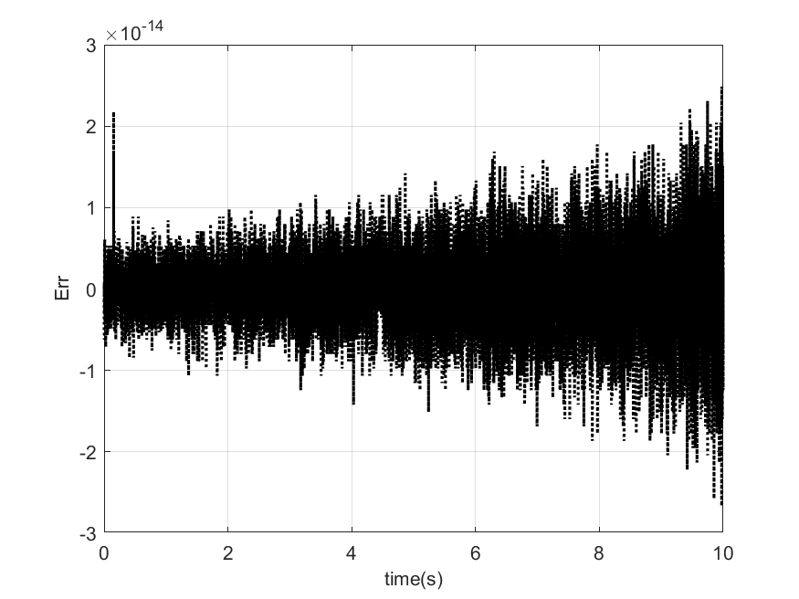 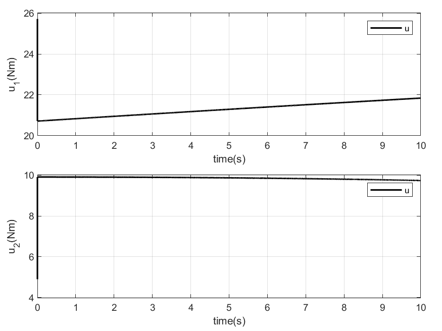 

### 3. mldivide, mrdivide function
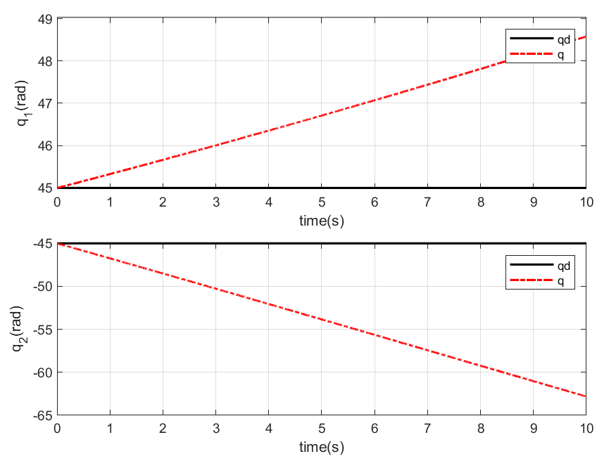 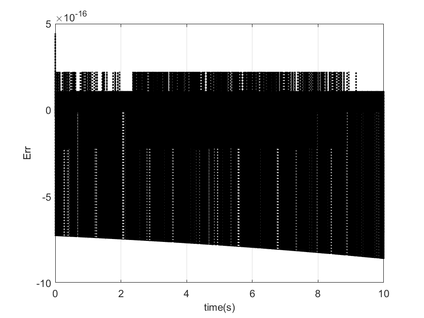  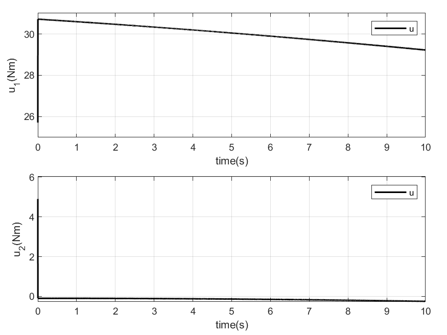 

### 4. round, mldivide, mrdivide function 
   

